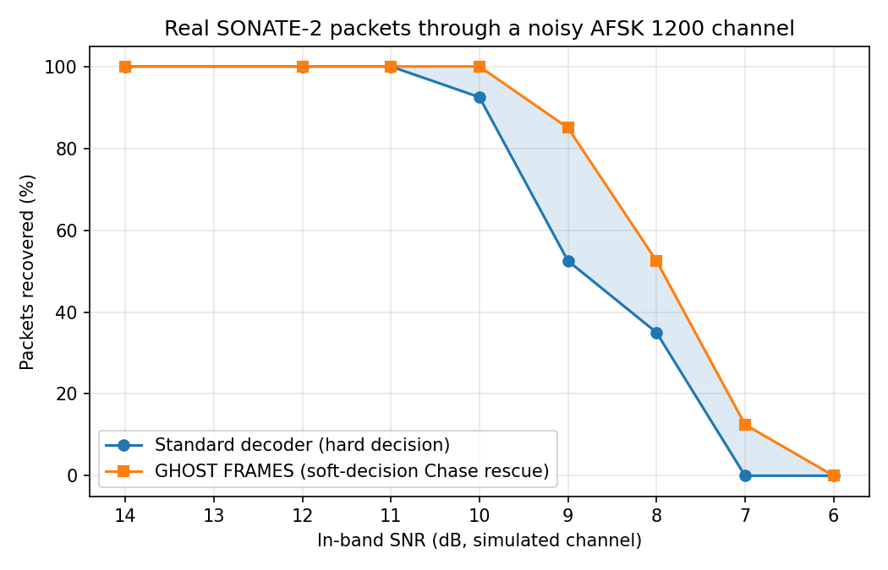
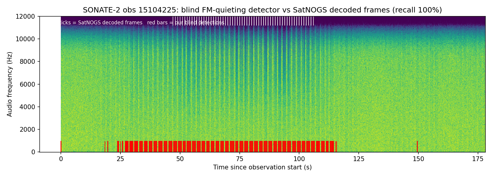
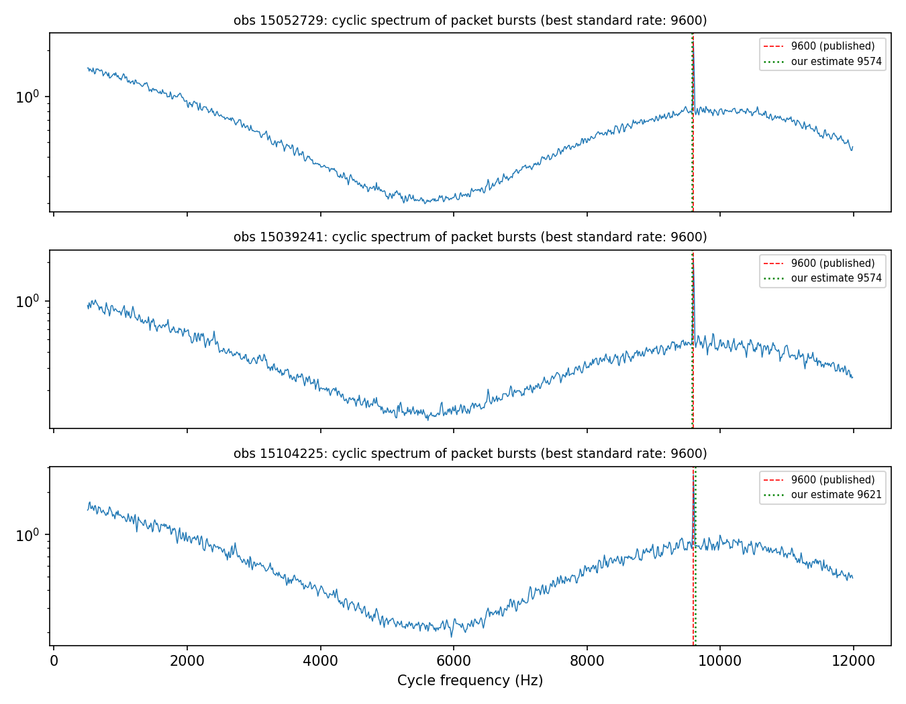
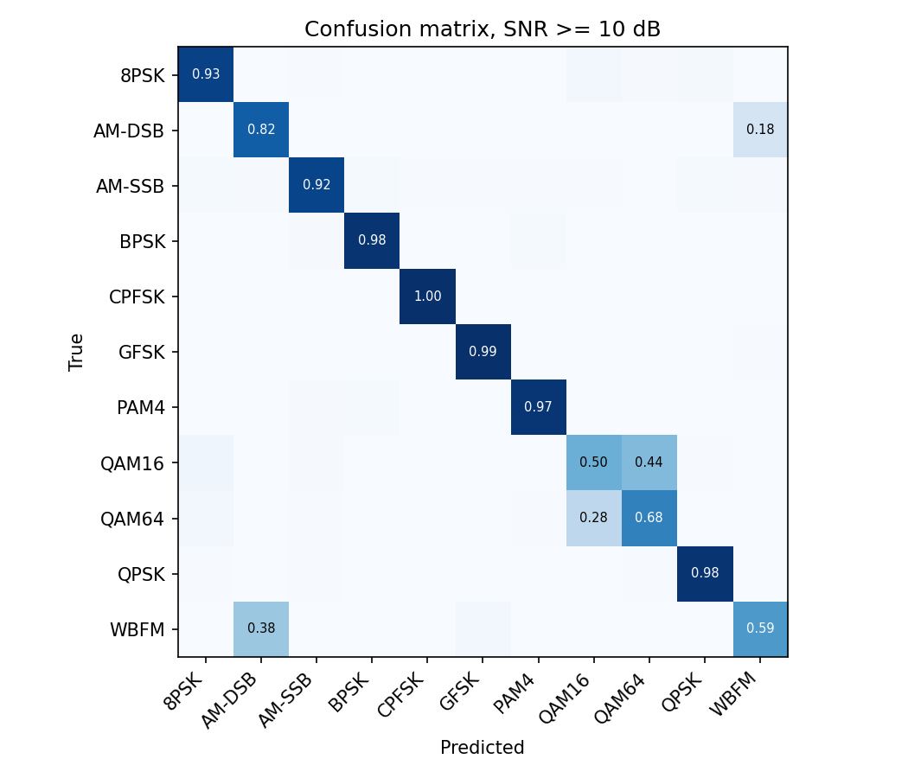
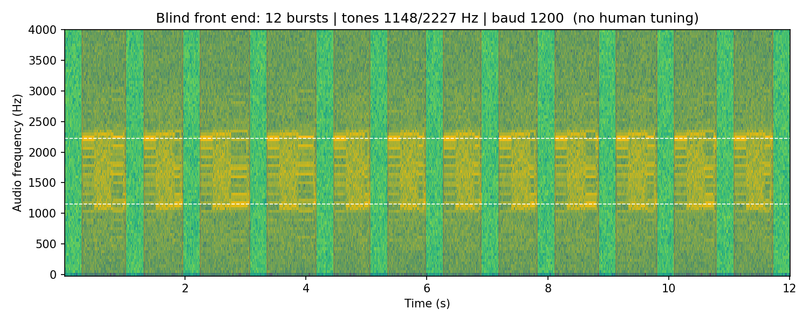

# GHOST FRAMES: Recovering the satellite packets ground stations throw away

**Track 1: Deep-Space Communication & Signal Intelligence** · MATLAB in Space Hackathon 2026

**Team:** Katie Nguyen · Ruchika Jha · Wisena Joseph

## Problem

When a satellite is far from the ground station or near the horizon, its signal becomes weak and noise flips some of the received bits. A single corrupted bit makes the packet's CRC check fail, and the receiver discards the entire frame, even if almost all of it was correct.

**Our goal:** build a receiver chain that **finds, identifies, decodes and rescues** satellite packets **with no human tuning**, and validate it on real data from the German CubeSat **SONATE-2 (NORAD 59112)** recorded by the SatNOGS ground-station network.

## Pipeline

```
raw audio ─► FIND ──────────► IDENTIFY ──────────► DECODE ─────────────────► RESCUE ──────────► VERIFY
             packet bursts     modulation type      AFSK demod, DPLL timing,   soft-decision     vs SatNOGS
             (FM quieting)     + symbol rate        NRZI, HDLC, bit-unstuff,   Chase decoding    ground truth
                               (blind)              CRC-16/X.25                (flip weakest bits)
```

| Stage | File | What it does |
|---|---|---|
| Find | `src/validate_bursts.py`, `src/frontend.py` | Detects packet bursts with an adaptive noise floor (median + k·MAD of each recording, no hand-set thresholds). The **FM-quieting** detector uses physics: an FM receiver's high-frequency noise drops when a carrier is present, so packets appear as noise *dips*. |
| Identify | `src/real_baud.py`, `src/frontend.py`, `src/radioml_classify.py` | Estimates the symbol rate from the cyclic spectrum of the detected bursts, and classifies the modulation type (11 classes on RadioML). |
| Decode | `src/afsk.py` | Bandpass → mark/space tone energy with blind tone-gain equalisation → zero-crossing DPLL timing (soft bits) → NRZI → HDLC flags → bit-unstuffing → CRC-16/X.25. |
| Rescue | `src/afsk.py` | When the CRC fails, flips combinations of the 1–3 **least-confident** symbol decisions and re-checks (Chase decoding). Flips happen on raw tone decisions *before* NRZI decoding, where errors are still isolated. |
| Verify | `src/sweep_real.py`, `src/validate_bursts.py` | Compares against SatNOGS's decoded frames and their timestamps. |

## Data

| Source | Use |
|---|---|
| SatNOGS DB: 2,543 SONATE-2 frames, 14 observations (Sept 21 – Oct 2, 2026) | Real packet payloads + ground truth |
| SatNOGS Network: audio of observations 15039241, 15052729, 15104225 | Real-signal validation of Find and Identify |
| RadioML 2016.10A | Track 1 benchmark for modulation classification |

**Cleaning** (in `src/sweep_real.py`): dropped empty frames, kept only SONATE-2's own beacon frames (AX.25 header `DP0SNX → CQ`, 2,525 of 2,543), removed duplicates received by several stations → **1,114 unique real packets**. SatNOGS stores frames without their 2-byte CRC, so we recompute it before modulation.

## Results

### 1. Chase rescue recovers packets a standard decoder drops
Real SONATE-2 packets through a simulated noisy AFSK 1200 channel (40 packets per SNR):

| In-band SNR | Standard decoder | GHOST FRAMES rescue | False accepts |
|---|---|---|---|
| 10 dB | 37/40 | **40/40** | 0 |
| 9 dB | 21/40 | **34/40** | 0 |
| 8 dB | 14/40 | **21/40** | 0 |
| 7 dB | 0/40 | **5/40** | 0 |



### 2. Finding real SONATE-2 packets in raw SatNOGS audio
Validated against the timestamps of frames SatNOGS actually decoded:

| Observation | SatNOGS decoded frames | Energy detector recall | FM-quieting detector recall |
|---|---|---|---|
| 15052729 | 602 | 100% | 100% |
| 15039241 | 382 | **0%** | **100%** |
| 15104225 | 195 | 100% | 100% |

The classic energy detector completely fails on 15039241; the physics-based FM-quieting detector works on all three. On 15104225, our detections start ~20 s before SatNOGS's first decoded frame and continue ~10 s after its last, matching visible packet stripes at the weak edges of the pass. These are **candidate packets SatNOGS did not decode** (not yet CRC-verified).



### 3. Measuring the symbol rate from raw SatNOGS audio
Using only the packet bursts found by the FM-quieting detector, low-passed to the data band (< 7 kHz) and averaged over many 85 ms windows, the cyclic spectrum shows a sharp line at the symbol rate:

| Observation | Blind estimate | Published | Error |
|---|---|---|---|
| 15052729 | 9574 baud | 9600 | 0.3% |
| 15039241 | 9574 baud | 9600 | 0.3% |
| 15104225 | 9621 baud | 9600 | 0.2% |



### 4. Identifying the modulation (RadioML 2016.10A benchmark)
Blind classification of 11 modulation types from 128 raw I/Q samples, using expert signal features (higher-order cumulants, amplitude/phase/frequency statistics, spectral lines of x² and x⁴) and a random forest. Trains in 4 s on a laptop CPU.

| SNR | Accuracy |
|---|---|
| −10 dB | 17.0% |
| 0 dB | 71.6% |
| ≥ 10 dB (mean) | **85.2%** |

Chance level is 9% (11 classes). At high SNR, 8 of 11 classes score 92–100%. Errors concentrate in two physically similar pairs: **QAM16 vs QAM64** (dense vs denser constellation) and **AM-DSB vs WBFM** (both analog audio).




### 5. Multi-station combining
Grouping SatNOGS frames by pass: on the Oct 2 pass, combining 5 stations gave 128 unique packets versus 110 for the best single station (+16%). On strong passes the gain was ~0%. Some "stations" are separate antennas at one site, so they are not fully independent.

### 6. Blind front end on synthetic signals
Detects 12/12 packets and estimates the symbol rate exactly (1200 baud AFSK; 9600 baud GMSK down to 4 dB), choosing the modulation family automatically.



## Key challenges
- **Packets were invisible to standard methods.** In real SatNOGS audio, packets appear as dips in noise (FM quieting), not added energy. A classic energy detector found 0% in one recording, so we built a physics-based detector.
- **Our first rate estimate failed.** Averaging over whole noisy recordings hid the 9600-baud line. Restricting to detected packets, filtering to the data band and averaging short windows fixed it.
- **Incomplete data:** SatNOGS strips the CRC from stored frames (we recompute it), and our RadioML download arrived truncated (we resumed it).

## Limitations (honest)
- The rescue curve uses **real packets** but a **simulated channel**. SNR is in-band audio SNR, not RF SNR.
- SONATE-2's beacon is 9600 GMSK; our full decoder implements **AFSK 1200** (the modulation of SONATE-2's own APRS digipeater), so we did not decode the real recordings end-to-end.
- On the two long recordings, the satellite transmits almost continuously, so detections cover most of the file and 100% recall there is weak evidence. Observation 15104225, with clear gaps, is the meaningful test.
- SatNOGS has no public decoder for SONATE-2's housekeeping fields (battery, temperatures), so we did not plot telemetry values.

## Next steps
1. GMSK 9600 + G3RUH descrambler decoder to decode the real recordings end-to-end and CRC-verify the candidate packets we detected at the edges of passes.
2. Decode SONATE-2 housekeeping telemetry (battery voltage, temperatures) from the team's published protocol definition.
3. Soft combining of the same packet received by several stations.

## How to run
```bash
pip install -r requirements.txt   # numpy scipy pandas matplotlib soundfile scikit-learn
python3 src/afsk.py                                          # decoder + rescue self-test (synthetic)
python3 src/sweep_real.py data/satnogs/sonate2_frames.csv   # rescue experiment on real packets
python3 src/validate_bursts.py                               # Find stage vs SatNOGS ground truth
python3 src/real_baud.py                                     # symbol rate from real audio
python3 src/radioml_classify.py RML2016.10a_dict.pkl         # RadioML benchmark (download the .pkl first)
python3 src/frontend.py                                      # blind front end (synthetic)
```

## Credits & License
- **RadioML:** DeepSig Inc., CC BY-NC-SA 4.0. O'Shea, T. J., & West, N. "Radio Machine Learning Dataset Generation with GNU Radio." *Proceedings of the GNU Radio Conference*, 2016.
- **SatNOGS:** Libre Space Foundation (frames, observations and audio from volunteer ground stations).
- **SONATE-2:** Julius-Maximilians-Universität Würzburg (callsign DP0SNX).
