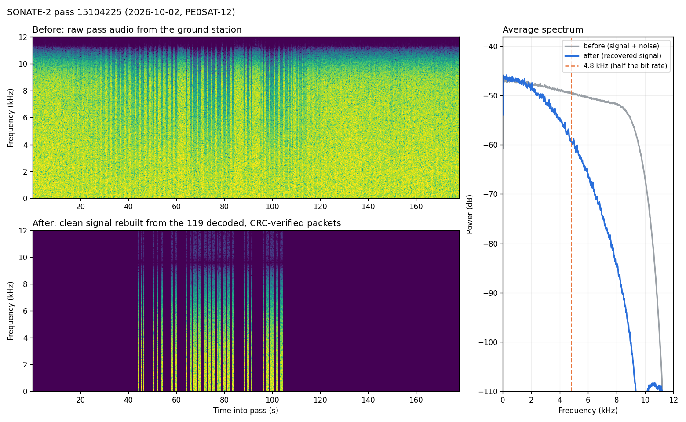
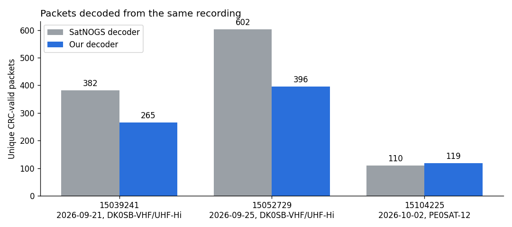
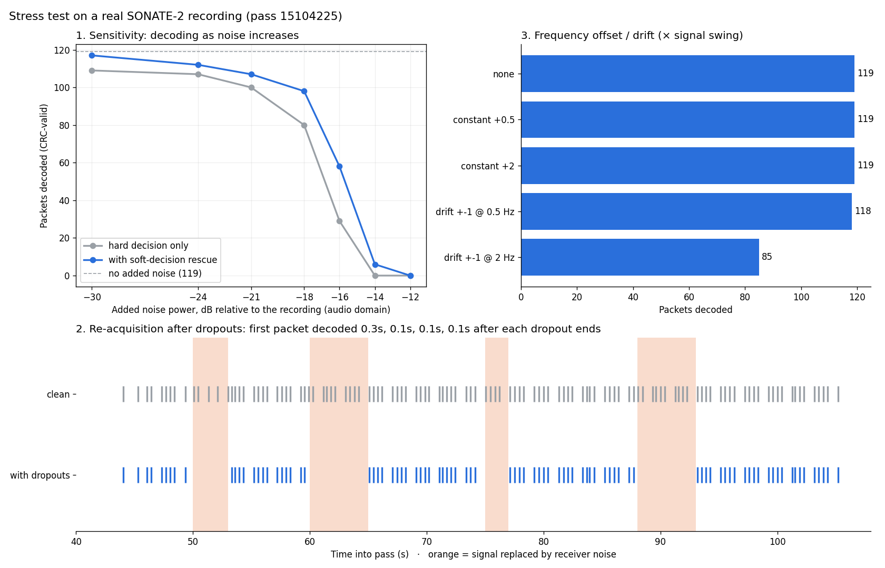
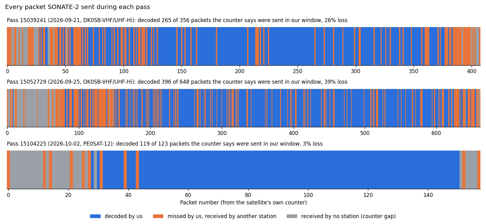
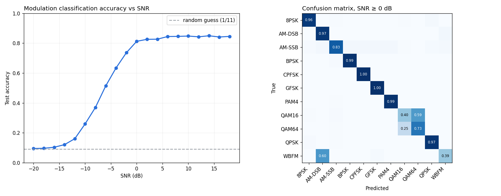

# GHOST FRAMES: recovering the satellite packets ground stations throw away

**Track selection:** Track 1, Deep-Space Communication & Signal Intelligence (MATLAB in Space Hackathon)
**Slide deck:** [GHOST_FRAMES_slides.pptx](GHOST_FRAMES_slides.pptx)
**Team:** Katie Nguyen · Wisena Joseph · [jha-ruch](https://devpost.com/jha-ruch)

---

## Project description

### Problem

When a satellite passes near the horizon, its received signal can become weak enough that noise and other signal impairments cause individual bits to be corrupted. Even a small number of errors can cause a packet's CRC to fail, causing the frame to be rejected as invalid by the decoder.

GHOST FRAMES is an automated receiver designed to recover these otherwise discarded frames. Our system detects weak signal bursts, estimates key signal parameters, demodulates and decodes the transmission, and attempts to repair corrupted frames using the least-confident received bits.

We evaluate the system using real satellite recordings from SONATE-2 through SatNOGS, while using RadioML 2016.10A to benchmark modulation classification across different signal-to-noise ratios.


### Approach

SONATE-2 sends telemetry at 437.025 MHz as **9600-baud GMSK** in AX.25 packets with G3RUH scrambling. Our decoder ([decoder.py](decoder.py)):

```
SatNOGS pass audio (48 kHz, FM-demodulated by the ground station)
1. Filter        subtract a 0.2 s moving average to remove Doppler/DC drift
2. Acquire       sample once per bit, searching 10 timing offsets (no clock setting)
3. Descramble    G3RUH descrambler + NRZI decode (signal polarity doesn't matter)
4. Frame sync    find HDLC flags, remove stuffed bits
5. Verify        CRC-16 checksum + AX.25 callsign check on every frame
6. Repair        if the CRC fails, flip the 1-2 least-confident bits and re-check
7. Log           verified packets -> telemetry CSV
```

Design choices:
- **No settings.** Drift, timing and polarity come from the recording itself; the same code runs unchanged on every pass and ground station.
- **Automatic re-acquisition.** The decoder searches for packet flags continuously, so it picks the signal back up after every fade with no reset.
- **Gentle filtering.** Scrambled 9600-baud data has content down to a few Hz, so a standard high-pass filter distorted the bits. A slow moving average took a test minute from 15 to 24 packets.
- **Soft-decision repair.** Each bit keeps its confidence (distance from zero). Flipping only the least-confident bits rescues packets a single bit error would otherwise kill. A callsign check rejects the rare noise frame that passes the CRC by chance.
- **Blind front end** ([src/frontend.py](src/frontend.py)). Finds packet bursts with no prior knowledge, using a threshold computed from each recording (median + k × MAD).
- **RadioML stage.** A modulation classifier trained on benchmark data, then tested on the real satellite signal.

### Datasets

| Dataset | Used for |
|---|---|
| **SatNOGS Network**: SONATE-2 (NORAD 59112) | Real pass recordings: the receiver's input |
| **SatNOGS DB** | 2,508 frames decoded by SatNOGS stations, used as ground truth |
| **RadioML 2016.10A** | Training modulation classifiers (11 modulations, −20 to +18 dB SNR); exploration in [explore.ipynb](explore.ipynb) |

| Pass | Date (UTC) | Ground station | Max elevation |
|---|---|---|---|
| [15104225](https://network.satnogs.org/observations/15104225/) | 2026-10-02 | PE0SAT-12 | 75° |
| [15052729](https://network.satnogs.org/observations/15052729/) | 2026-09-25 | DK0SB | 51° |
| [15039241](https://network.satnogs.org/observations/15039241/) | 2026-09-21 | DK0SB | 89° |

Credits: SatNOGS (Libre Space Foundation); SONATE-2 (University of Würzburg); RadioML by DeepSig Inc., CC BY-NC-SA 4.0: O'Shea, T. J., & West, N. "Radio Machine Learning Dataset Generation with GNU Radio." *Proceedings of the GNU Radio Conference*, 2016.

---

## How to run

```bash
pip install -r requirements.txt

python decoder.py data/satnogs/sonate2_15104225/audio.ogg   # decode one recording (live demo)
python run_pipeline.py                                      # all passes: telemetry logs, plots, SatNOGS comparison; opens a summary
```

The three pass recordings and SatNOGS ground-truth frames are included in `data/`. All outputs go to `results/`.

---

## Results

### Key metrics

| Metric | Result |
|---|---|
| Checksum-verified telemetry packets | **780** from 3 real passes, no settings changed |
| Ghost frames (valid packets SatNOGS's decoder missed on the same recording) | **10**: 8 recovered by bit repair, 7 confirmed by other stations |
| Packets rescued by bit repair | **41%** |
| Re-acquisition after signal dropouts | **≤ 0.4 s**, every time, no reset |
| Self-measured packet loss (strongest pass) | **3%**, from the satellite's own packet counter |
| Blind burst detection vs. SatNOGS packet times | **100%** recall on all 3 passes |
| RadioML classifier accuracy | **84%** at SNR ≥ 0 dB (57% overall) |

### Before/after spectral plot (Track 1)

Top: raw ground-station audio; packet bursts are faint stripes in the noise. Bottom: the clean signal rebuilt from our CRC-verified packets. Right: the recovered spectrum rolls off near 4.8 kHz, as 9600-baud GMSK should. Other passes: [15039241](results/spectrum_15039241.png) · [15052729](results/spectrum_15052729.png)



### Telemetry log (Track 1)

All 780 packets are in [results/telemetry_log.csv](results/telemetry_log.csv). `DP0SNX` is SONATE-2's callsign.

| Pass | UTC (approx.) | From → To | Bytes | Bits repaired | Payload (start) |
|---|---|---|---|---|---|
| 15039241 | 2026-09-21 16:10:45 | DP0SNX → CQ | 146 | 0 | `2700ba4618000864eb5b…` |
| 15039241 | 2026-09-21 16:10:48 | DP0SNX → CQ | 82 | 1 | `2702bc37180008c8c032…` |
| 15039241 | 2026-09-21 16:10:50 | DP0SNX → CQ | 63 | 0 | `2702bf39180008d3e0e7…` |
| 15039241 | 2026-09-21 16:10:51 | DP0SNX → CQ | 146 | 1 | `2700c04918000864eb5e…` |
| 15039241 | 2026-09-21 16:11:03 | DP0SNX → CQ | 146 | 2 | `2700ca4f18000864eb64…` |

### Our decoder vs. SatNOGS

Both decoders ran on the same recordings:

| Pass | Station | SatNOGS | **Ours** | Both | Repaired |
|---|---|---|---|---|---|
| 15104225 | PE0SAT-12 | 110 | **119** | 110 | 8 |
| 15039241 | DK0SB | 382 | **265** | 265 | 118 |
| 15052729 | DK0SB | 602 | **396** | 395 | 192 |



On the strongest pass we decoded every packet SatNOGS did, plus 9 more. On the DK0SB passes we recover about two thirds, losing the weak start and end of each pass.

### Autonomy: stress test on a real recording

We injected impairments into the strongest recording ([stress_test.py](stress_test.py)):



- **Dropouts:** four 2–5 s stretches replaced with receiver noise. The decoder picked up the first packet after each one within **0.06–0.35 s**.
- **Noise:** bit repair decodes more packets at every level; near the limit, **58 vs. 29 (2×)**, about 1 dB of gain (audio-domain SNR).
- **Frequency offset:** constant offsets up to 2× the signal swing and slow drift cost at most 1 packet; very fast drift (2 Hz) costs 29%.

A second sweep ([src/sweep_real.py](src/sweep_real.py)) sends 40 real SONATE-2 frames through a simulated AFSK 1200 channel: at 9 dB, rescue recovers **85% vs. 52.5%**, with **zero false accepts**. [Plot](src/results/sweep_real.png)

### Self-measured packet loss

Payload byte 2 is a packet counter (inferred from the data), so every gap is a packet we missed. No ground truth is needed:



| Pass | Decoded | Counter says sent | Loss |
|---|---|---|---|
| 15104225 | 119 | 123 | **3%** |
| 15039241 | 265 | 356 | **26%** |
| 15052729 | 396 | 648 | **39%** |

Our counter numbers matched other stations' on every shared packet.

### Blind front end

The FM-quieting detector (packets appear as dips in 7–10.5 kHz noise) found a burst at **every** time SatNOGS received a packet, on all three passes; a plain energy detector failed on one pass. [Plot](results/frontend_real_15104225.png)

### RadioML



A 1-D CNN reaches **84% at SNR ≥ 0 dB**, matching published baselines; a feature-based random forest ([src/radioml_classify.py](src/radioml_classify.py)) provides an interpretable alternative. On real SONATE-2 windows the CNN answers FSK-family (correct for GMSK) **88–95%** of the time, but noise also looks FSK-like after we rebuild I/Q from audio, so transfer is **promising, not proven**. [Transfer plot](results/radioml_transfer.png)

---

## Limitations and next steps

- **Weak pass edges.** We lose packets when the satellite is low. Next: a tracking timing loop (Gardner) instead of the offset search, which would also speed up decoding (currently ~1 min per 3 min of audio).
- **Audio input, not raw I/Q.** The ground station did the carrier tracking. Next: decode raw I/Q and track the carrier ourselves.
- **Payload fields unparsed.** SONATE-2's telemetry format isn't public; SatNOGS's own decoder also extracts only the AX.25 header.
- **RadioML transfer inconclusive** on audio-derived I/Q. Next: rerun on raw I/Q.
- **Blind baud estimate fails** on this audio (reports 782 baud, not 9600). The decoder doesn't rely on it.
- **One modulation.** Next: use a modulation classifier to choose the demodulator automatically.
